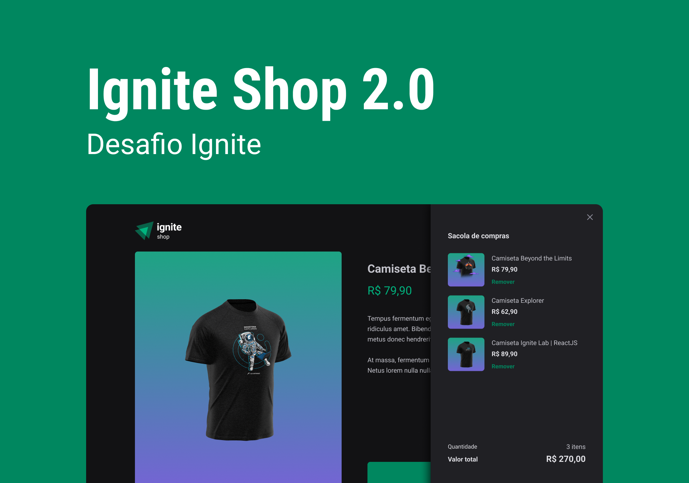

<p align="center">
  
</p>

<br/>

## **💻** Projeto

Quem nunca teve - ou pelo menos tentou - criar um e-commerce? Hoje, com o crescimento da internet, a loja que não está no digital praticamente não existe no mundo real. Como desenvolvedor, uma das maiores demanda é a criação de e-commerce e, a fim consolidar meus conhecimentos sendo alinhado com as novas e melhores práticas e tecnologias disponíveis no mundo da tecnologia, desenvolvi uma aplicação realizada durante o programa de aceleração “Ignite - ReactJS”, promovido pela Rocketseat, a qual desenvolvemos uma aplicação Frontend de uma loja de compras de camisa utilizando NextJS, Stitches e o Stripe para efetivação da compra.  Em sua versão 2.0, foi adicionado - para a conclusão do desafio - carrinho para compras múltiplas. 
<br/>

<p align="center">
  
</p>


<br/>

## Tecnologias utilizadas

- [Typescript](https://www.typescriptlang.org/)
- [ReactJS](https://pt-br.reactjs.org/)
- [NextJS](https://nextjs.org/)
- [Axios](https://axios-http.com/ptbr/docs/intro)
- [Keen-slider](https://keen-slider.io/)
- [Stripe](https://stripe.com/br)
- [Stitches](https://stitches.dev/)
- [eslint](https://eslint.org/)

## **🔖** Layout

Você pode visualizar o layout do projeto através do link abaixo:

- [Figma](https://www.figma.com/file/Ctn2eMiaFwTU1KFCaetK0k/Ignite-Shop-2.0-(Copy)?t=ByWt1xHjePoXdFcp-6)

Lembrando que você precisa ter uma conta no [Figma](http://figma.com/)

<br/>

## **🚀** Como Executar

```bash
## Clone o projeto em sua máquina
git clone [https://github.com/srsouzaj/](https://github.com/srsouzaj/nlwsetup)04-igniteshop.git

# Acessar o projeto no terminal
$ cd 04-igniteshop

# Instalar as dependências
$ npm install

# Executar o servidor em modo de desenvolvimento
$ npm run dev
```

<br/>

## 📝 License

Esse projeto está sob a licença MIT. Veja o arquivo [LICENSE](https://github.com/srsouzaj/04-igniteshop/blob/main/LICENSE.md) para mais detalhes.

Feito com ❤️ por Jorge de Souza
